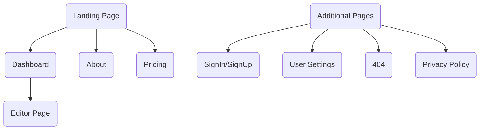

# Wiremap [](https://app.netlify.com/sites/wiremap/deploys)

Quickly and easily visualise your application sitemap structure with a comprehensive & user-friendly interface, combined with a range of useful features, to help facilitate a rapid streamlined development process.


## Features

- ✅ | User Authentication
- ⬜️ | Create Sitemap
    1. ✅ | Add Cell
    2. ⬜️ | Edit Cell
    3. ⬜️ | Remove Cell
    4. ✅ | Add Element
    5. ⬜️ | Edit Element
    6. ⬜️ | Remove Element
    7. ✅ | Add Sub Element
    8. ⬜️ | Edit Sub Element
    9. ⬜️ | Remove Sub Element
- ⬜️ | Edit Sitemap
- ⬜️ | Remove Sitemap
- ⬜️ | User Settings
    1. - ⬜️ | Edit User Settings
    2. - ⬜️ | Create Organisation
    3. - ⬜️ | Edit Organisations
    4. - ⬜️ | Remove Organisations

## Technologies

- [Next.js](http://next.js/)
- [Tailwinds](http://tailwinds.com/)
- [TypeScript](http://typejs.org/)
- [Markdown](http://markdown.org/)
- [MongoDB](http://mongodb.org/)

## Application Structure



## Getting Started

1. Clone the repository:

    ```bash
    git clone https://github.com/wiremapp/app.git
    ```

2. Install the dependencies:

    ```bash
    npm i
    # or
    yarn
    ```

3. Copy the `env.example` to a new file `env.local`:

    ```bash
    cp .env.example .env
    ```

    env.example:

    ```js
    NODE_ENV=
    NEXT_PUBLIC_STATIC_TITLE="An Open-Source Sitemap Visualiser"
    NEXT_PUBLIC_APP_TITLE="Wiremap"
    NEXT_PUBLIC_SITE_URL="https://wirem.app/"
    NEXTAUTH_URL="http://localhost:3000/"
    GOOGLE_OAUTH_CLIENT_ID=
    GOOGLE_OAUTH_CLIENT_SECRET=
    NEXTAUTH_SECRET=
    ```

4. Run the development server:

    ```bash
    npm run dev
    # or
    yarn dev
    ```

Open [http://localhost:3000](http://localhost:3000) with your browser to see the result.

## Available Scripts

In the project directory, you can run:

### `npm start`

Runs the app in the development mode.

Open [http://localhost:3000](http://localhost:3000) to view it in the browser.

### `npm test`

Launches the test runner in the interactive watch mode.

See the section about [running tests](https://facebook.github.io/create-react-app/docs/running-tests) for more information.

### `npm run build`

Builds the app for production to the `build` folder.

See the section about [deployment](https://facebook.github.io/create-react-app/docs/deployment) for more information.

## Learn More

You can learn more in the [React documentation](https://reactjs.org/).

## License

This repository is open source. However, please note that no license file is included. As a result, the use of this repository or any of its material for any purpose beyond personal or educational use is not authorised.
