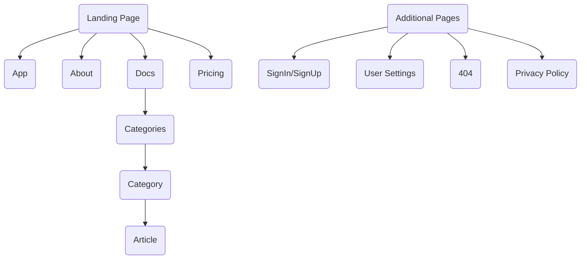

# Wiremap [](https://app.netlify.com/sites/wiremap/deploys)

Quickly and easily visualise your application sitemap structure with a comprehensive & user-friendly interface, combined with a range of useful features, to help facilitate a rapid streamlined development process.


## Technologies

- [Next.js](http://next.js/)
- [Tailwinds](http://tailwinds.com/)
- [TypeScript](http://typejs.org/)
- [Markdown](http://markdown.org/)
- [MongoDB](http://mongodb.org/)

## Application Structure



## Getting Started

1. Clone the repository:

    ```bash
    git clone https://github.com/wiremapp/app.git
    ```

2. Install the dependencies:

    ```bash
    npm i
    # or
    yarn
    ```

3. Run the development server:

    ```bash
    npm run dev
    # or
    yarn dev
    ```

Open [http://localhost:3000](http://localhost:3000) with your browser to see the result.

## Available Scripts

In the project directory, you can run:

### `npm start`

Runs the app in the development mode.

Open [http://localhost:3000](http://localhost:3000) to view it in the browser.

### `npm test`

Launches the test runner in the interactive watch mode.

See the section about [running tests](https://facebook.github.io/create-react-app/docs/running-tests) for more information.

### `npm run build`

Builds the app for production to the `build` folder.

See the section about [deployment](https://facebook.github.io/create-react-app/docs/deployment) for more information.

## Learn More

You can learn more in the [React documentation](https://reactjs.org/).
